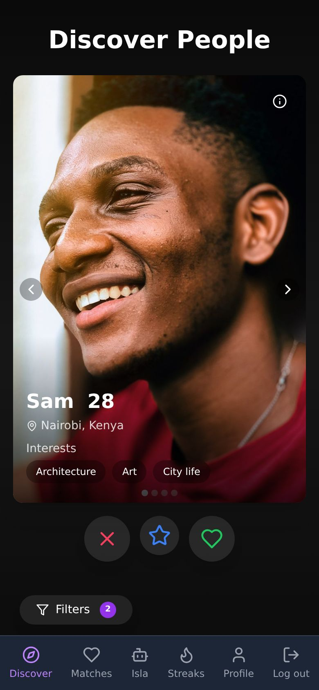
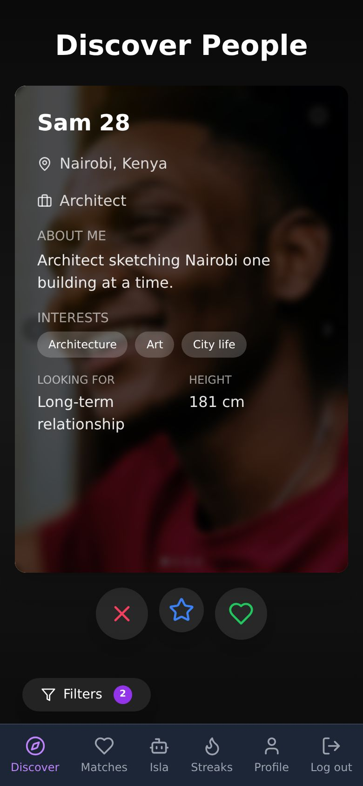
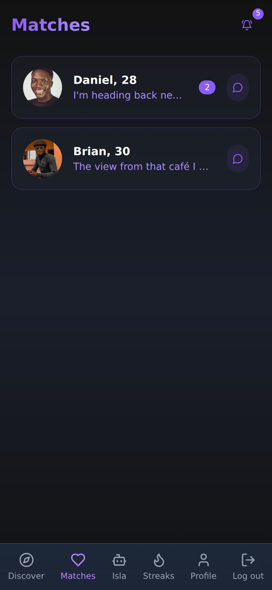
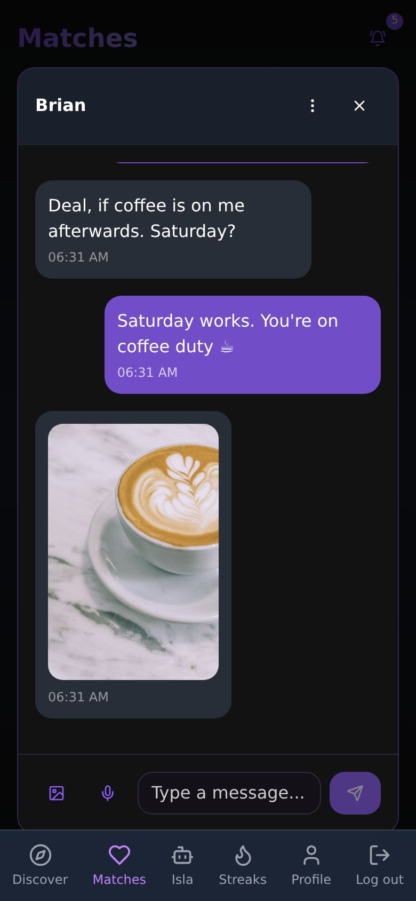
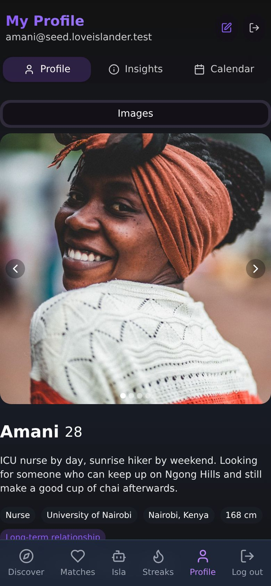
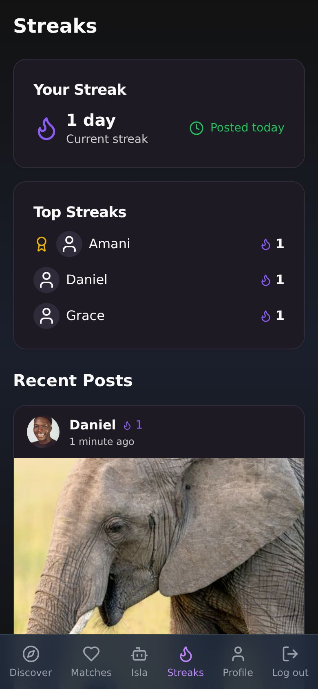
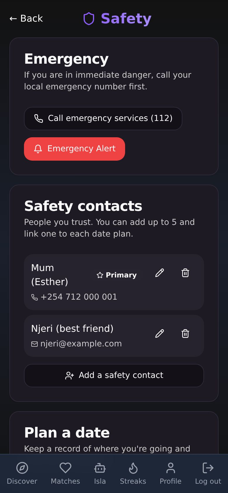
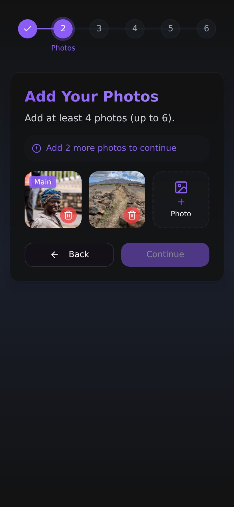
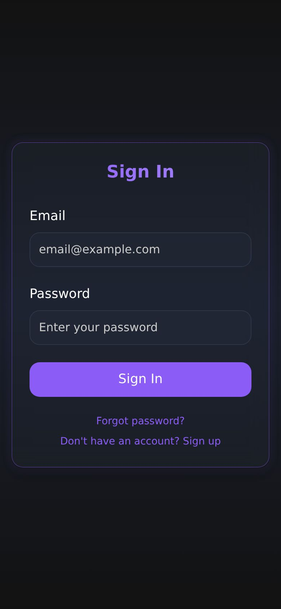

# Love Islander

A dating app: profiles and photos, discovery with mutual matching, chat, daily photo streaks, an AI dating companion,
Google Calendar date planning, safety tools (blocking, reporting, safety contacts, date plans, emergency alerts), and
a moderation queue where moderators review reports.

- **Web/mobile client:** React 18 + TypeScript + Vite, Tailwind/shadcn, Capacitor shell (`web/`)
- **API:** FastAPI + SQLAlchemy + Alembic on Python 3.12 (`backend/`)
- **Platform:** Postgres 16 (schema by Alembic), Supabase Auth and Storage (`supabase/`)

## Screenshots
Captured from the running app (local stack with the [seed accounts](docs/development/seed-data.md)): real API data
through the real UI, at phone size. The people and conversations are fictional; photos are from Pexels
([credits](docs/development/seed-data.md#photo-credits)).

<table>
  <tr>
    <td align="center" width="33%"> <b>Discover</b> Swipe through people who match your preferences</td>
    <td align="center" width="33%"> <b>Profile details</b> Bio, interests, what they're looking for</td>
    <td align="center" width="33%"> <b>Matches</b> Mutual likes, last message and unread count</td>
  </tr>
  <tr>
    <td align="center" width="33%"> <b>Chat</b> Messages and photo sharing</td>
    <td align="center" width="33%"> <b>Your profile</b> Photos, details and insights</td>
    <td align="center" width="33%"> <b>Streaks</b> Daily photo posts and the leaderboard</td>
  </tr>
  <tr>
    <td align="center" width="33%"> <b>Safety centre</b> Trusted contacts, date plans, emergency alert</td>
    <td align="center" width="33%"> <b>Onboarding</b> Six guided steps, at least four photos</td>
    <td align="center" width="33%"> <b>Sign in</b> Email and password with Supabase Auth</td>
  </tr>
</table>

To refresh them after UI changes: `SEED=1 npm run test:e2e -- --config=playwright.screenshots.config.ts` (writes
`docs/images/screenshots/`).

## Repository layout
| Path | Contents |
|---|---|
| `web/` | React + Vite web app and Capacitor shell |
| `backend/` | FastAPI API, Alembic migrations, API tests |
| `e2e/` | Playwright end-to-end tests for the whole stack |
| `supabase/` | Supabase CLI project: local Auth/Storage config, frozen legacy migrations, policy tests |
| `deploy/` | Web image (Dockerfile, nginx) |
| `scripts/` | End-to-end runner, clean-clone check, database operations (`scripts/db/`) |
| `docs/` | Documentation ([index](docs/README.md)) |

The root `package.json` is an npm-workspaces root (`web`, `e2e`); `npm run build`, `npm test`, `npm run lint` and the
other scripts run from the root. Details: [docs/development/repository-layout.md](docs/development/repository-layout.md).

## Getting started
Set up from a fresh clone with [docs/development/setup.md](docs/development/setup.md); the test suites and the
`make check` / `make ci` shortcuts are described in [docs/development/testing.md](docs/development/testing.md).
All documentation is listed in [docs/README.md](docs/README.md).

To try the app with realistic data, seed the local stack: `SEED=1 npm run test:e2e` (or `uv run python -m seed run` in
`backend/` against a running stack) creates fictional accounts in every state, including a moderator, all with the
password `LoveIsland-Seed-2026!`; see [seed accounts](docs/development/seed-data.md). Moderator roles are granted
only with the operator CLI ([moderation](docs/operations/moderation.md)).

## Status
Every feature has a passing test or a documented limitation in the
[test coverage matrix](docs/development/test-matrix.md): API tests on real Postgres, web component tests, database
policy tests, and end-to-end tests of every page at phone, tablet and desktop sizes on the real local stack, which fail
on any console error or server error. What still needs the owner (credentials, providers, legal text, production
steps) is listed in [docs/STATUS.md](docs/STATUS.md#before-launch) and
[docs/operations/production-actions.md](docs/operations/production-actions.md).
